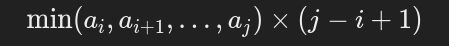
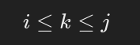
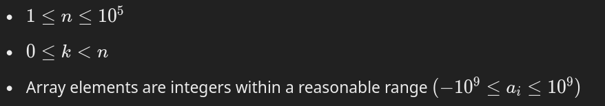

## Problem Statement

Given an integer \( n \) (the size of the array) and an integer \( k \) (a specific index within the array), along with an array of integers, your task is to **maximize** the following expression:



subject to the condition:



### Input

- An integer \( n \) representing the size of the array.
- An integer \( k \) representing the specific index within the array (0-based).
- An array of \( n \) integers.

### Output

- A single integer representing the maximum possible value of the above expression

### Example

**Input:**

```
n = 5
k = 2
array = [3, 1, 6, 4, 5]
```

**Output:**

```
12
```

### Explanation

The optimal subarray in this example is \([6]\) when \(i = 2, j = 4\).

### Constraints

