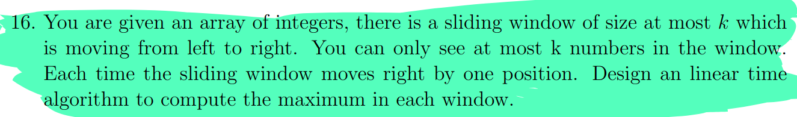

# Question



# Execution and Testing Instructions

## Instructions

### 1. Prepare Input

- **Manual Input**: 
  - Go to the input folder:
    ```bash
    cd input
    ```
  - Place your input data in the `input_file` file. This file should contain the test cases that the program will process.

- **Generate Random Input**:
  - Go to the input folder:
    ```bash
    cd input
    ```
  - **Option 1: Using Script**: Run `./generate_tc.sh` to automatically generate random test cases.  
  - **Option 2: Manual Generation**: Compile and run the `generate_test_cases.cpp` file manually:
    ```bash
    g++ generate_test_cases.cpp -o generate_tc && ./generate_tc
    ```
### 2. Run the Program

To execute the program, follow these steps:

- **Using Script**:
  - Run the script `./run.sh` to compile and execute the program.

- **Manual Compilation**:
  - Compile and run the program manually using the following command:
    ```bash
    g++ main.cpp -o main && ./main
    ```

### 3. Test Against Brute Force

To test the solution against a brute-force implementation:

- Go to the tests folder:
  ```bash
  cd tests
  ```
- **Using Script**:
  - Run the script `./run_tests.sh` to execute the tests.

- **Manual Testing**:
  - Compile and run the `test.cpp` file manually:
    ```bash
    g++ test.cpp -o test && ./test
    ```