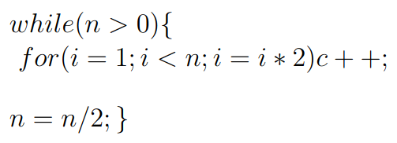

# Question



## Mathematical Expression Analysis

### Inner Loop Execution

The inner loop's execution count can be expressed as the sum:

```cpp
log(n) + log(n / 2) + log(n / 4) + ...
```

This sum can be generalized as:

```cpp
Σ log(n / (2^x)), for 0 <= x < log(n)
```

### Simplifying the Sum

The above sum can be expanded and simplified as:

```cpp
Sum = Σ (log(n) - x * log(2)), for 0 <= x < log(n)
```

### Breaking Down the Components

- **First Component:**  
  The first part of the sum, `Σ log(n)`, is a constant repeated `log(n)` times. Therefore, it simplifies to:

  ```cpp
  log(n) * log(n) = (log(n))^2
  ```

- **Second Component:**  
  The second part of the sum involves the variable `x` and can be expressed as:

  ```cpp
  log(2) * (log(n) * (log(n - 1) + 1) / 2)
  ```

### Final Expression

Combining both components, the entire sum simplifies to:

```cpp
(log(n))^2 - log(2) * (log(n) * (log(n) - 1) / 2)
```

However, since the second term is of a lower order compared to the first, it does not affect the asymptotic complexity. Thus, the final result is dominated by:

```cpp
(log(n))^2
```

This demonstrates that the second term is insignificant in comparison to the first, confirming that the overall time complexity is `O(log^2 n)`.
