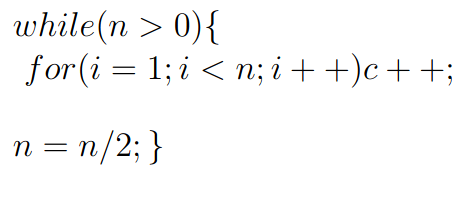

# Question



# Analysis

- The total number of operations performed by the `for` loop across all iterations of the `while` loop is:
```c++
  n + n/2 + n/4 ....
```

- This series is a geometric series with the first term `n` and a common ratio of `1/2`.

- The sum of this geometric series converges to:

  \[
  S = 2n
  \]

- Therefore, the total time complexity of the code is `O(n)`.
