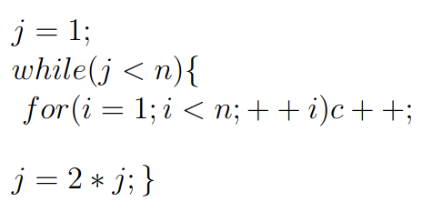

# Question



# Analysis 

- The inner for loop runs `n times` for each iteration of the while loop.

- Since the while loop runs `O(log n)` times, 
```c++
the total number of operations is: n*log(⁡n)
```

Therefore, the overall time complexity of the code is `O(n log(n))`.