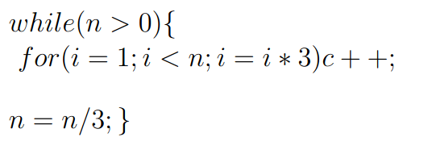

# Question



# Analysis

- The analysis follows the same approach as `Problem 6a`, where we examined how the loops decrease the problem size and the number of iterations.
- In this case, the outer loop reduces `n` by a factor of 3 each time (`n = n / 3`), and the inner loop increases `i` by a factor of 3 each time (`i = i * 3`).

- **Outer Loop**: Runs `O(log_3 n)` times because `n` is divided by 3 in each iteration.
- **Inner Loop**: Runs `O(log_3 n)` times within each iteration of the outer loop because `i` is multiplied by 3 each time.

- **Resulting Time Complexity**:
  
  ```c++
  O((log(n))^2)
  ```

  - **Note**: The logarithm here is to the base 3, but in Big-O notation, the base of the logarithm doesn't change the complexity class. A logarithm to any base is equivalent up to a constant factor, so it’s common to simplify and write it as `log(n)` without specifying the base.
