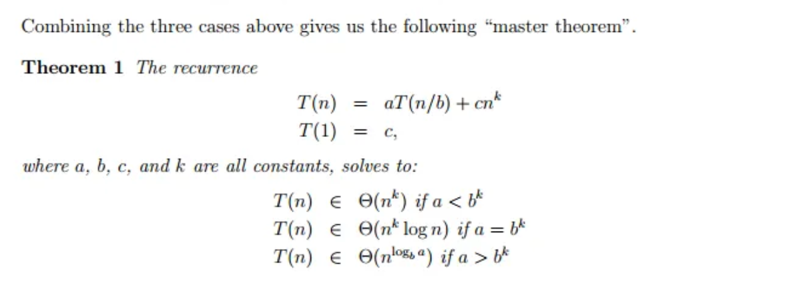
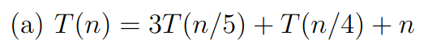
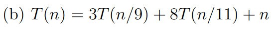
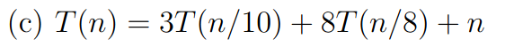
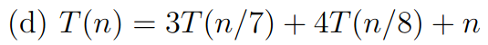
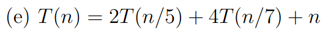
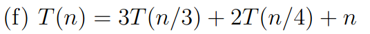
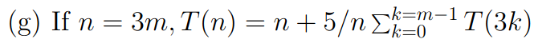
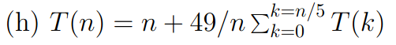
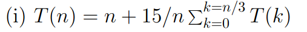

# MASTER THEOREM


# a\) Question


## Solution
- Substitute `T(n) = c * n`
- We get 
```c++
T(n) = 3cn/5 + cn/4 + n
T(n) = n * (3c/5 + c/4 + 1)

since T(n) = c*n

c*n = n * (3c/5 + c/4 + 1)

c = 17c/20 + 1

solving for c, we get c = 20/3 

we can see that T(n) = (20 / 3) * n
Therefore T(n) = Θ(n), which is linear
```

# b\) Question


## Solution 
```c++
T(n) = 3T(n/9) + 8T(n/11) + n

T(n) >= 3T(n/11) + 8T(n/11) + n

T(n) >= 11T(n/11) + n

T(n) >= Θ(n log(n))

Therefore T(n) is not linear
```

# c\) Question 


## Solution
```c++
T(n) = 3T(n/10) + 8T(n/8) + n

T(n) >= 11T(n/10) + n

T(n) >= Θ(n^(log_10(11)))

since log_10(11) > 1, we can conclude T(n) is not linear 
```

# d\) Question


## Solution
```c++
Refer 7a

we can see that the T(n) = 14*n
Therefore T(n) is linear
```

# e\) Question


## Solution
```c++
T(n) = 2T(n/5) + 4T(n/7) + n

similar to 7a,

we get T(n) = 35n
Therefore T(n) is linear
```

# f\) Question


## Solution
```c++
T(n) = 3T(n/3) + 2T(n/4) + n

T(n) >= 5T(n/4) + n

T(n) >= Θ(n^(log_4(5)))

therefore T(n) is not linear
```

# QUESTION G to I needs review

<!-- # g\) Question


## Solution
```c++
T(n) = n + 5/n ΣT(3k) for 0 <= k <= m-1

Assume T(n) = c*n

T(n) = n + 5/n * 3c Σ k for 0 <= k <= m-1

T(n) = n + 5/n * 3c * m*(m-1)/2 

T(n) = n + c * 5/6 * (n - 3)

T(n) = n + (n * c * 5/6) - (5/2 * c)

T(n) = n ( 1 + 5c / 6) - (5c / 2)

// Now calculate the value of c
// w.k.t T(n) = c*n

So, c = 1 + 5c / 6 
Therefore , c = 6

T(n) = 16n - 15

Hence, it is linear
```
# h\) Question


## Solution 

```c++
T(n) = n + 49/n ΣT(k), for 0 <= k <= n/5

Assume T(n) = c*n 

T(n) = n + 49/n * c*Σk, for 0 <= k <= n/5

T(n) = n + 49c/n * n/5 * (n/5 + 1)/2

T(n) = n + 49c/10 * (n/5 + 1)

T(n) = n (1 + 49c/50) + 49c/10

Find value of c 
c = (1 + 49c/50), since T(n) = c*n

c = 50

Therefore T(n) = 50n, which is linear
```

# i\) Question


```c++
T(n) = n + 15/n * ΣT(k), for 0 <= k <= n/3

Assume T(n) = c*n

T(n) = n + 15/n * cΣk, for 0 <= k <= n/3

T(n) = n + 15/n * c * n/3 * (n/3 + 1) / 2

T(n) = 
```

# EXTRA\): T(n) = 1 + n + T(k) + T(n - 1 - k)
for 0 <= k <= n - 1 

# EXTRA\): T(n) = SUM(1/n (n + max(T(k), T(n - 1 - k)))) k = 0 to n-1 -->